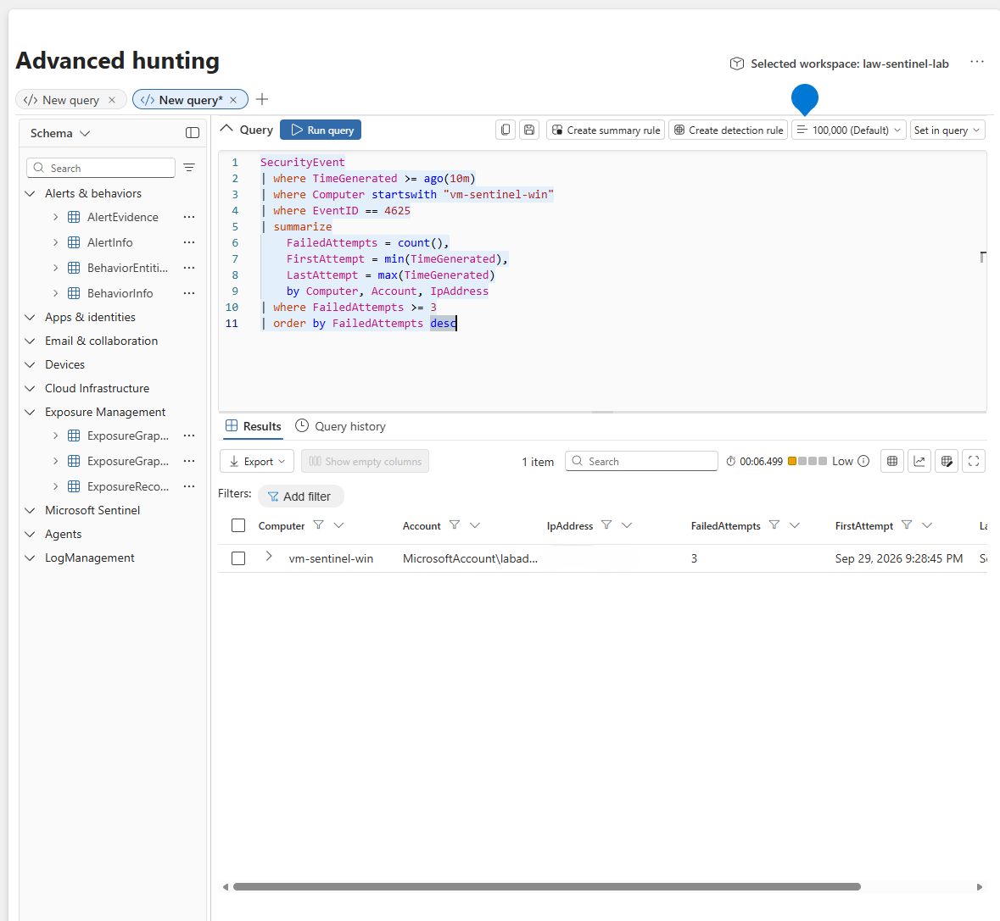
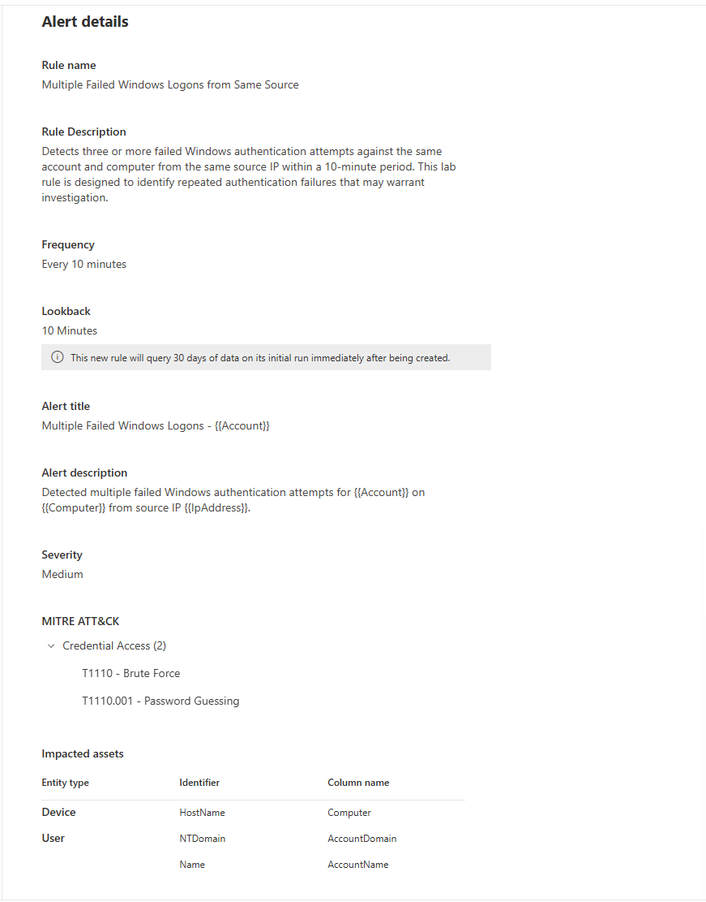
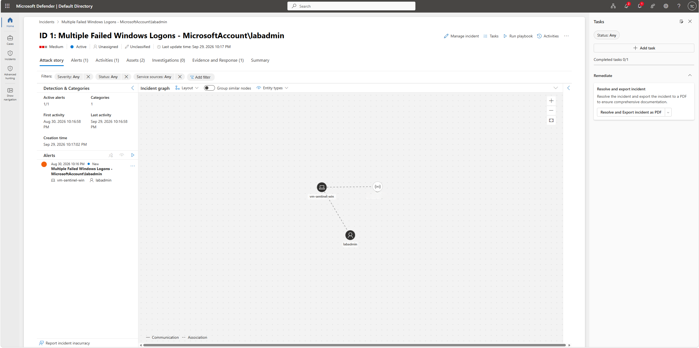

# Microsoft Sentinel Security Monitoring Lab

## Project Overview

This project demonstrates a hands-on Security Operations Center (SOC) workflow using Microsoft Sentinel and a Windows Server virtual machine hosted in Microsoft Azure. The lab was designed to practice collecting and analyzing Windows security events, performing threat hunting with Kusto Query Language (KQL), creating a custom detection rule, investigating a generated security incident, and documenting the incident response process.

The primary scenario involved detecting multiple failed Windows authentication attempts. Windows Security Event logs were collected and analyzed in Microsoft Sentinel, where KQL queries were used to investigate authentication activity and correlate failed and successful logons. A custom detection rule was then used to generate a Microsoft Sentinel incident for investigation.

> **Note:** All activity documented in this repository was generated in a controlled personal lab environment for cybersecurity training purposes.

---

## Objectives

The objectives of this lab were to:

- Deploy a Windows Server endpoint in Microsoft Azure.
- Collect Windows Security Event logs in Microsoft Sentinel.
- Use KQL to investigate Windows authentication activity.
- Identify failed Windows logons using Event ID 4625.
- Compare failed logons with successful authentication events (Event ID 4624).
- Analyze Windows process creation activity using Event ID 4688.
- Develop a custom detection for repeated authentication failures.
- Investigate a Microsoft Sentinel security incident.
- Map the detected activity to the MITRE ATT&CK framework.
- Document investigation findings and incident resolution.

---

## Lab Architecture

The lab followed the following monitoring and investigation workflow:

```text
Windows Server VM
       |
       v
Windows Security Event Logs
       |
       v
Azure Log Analytics Workspace
       |
       v
Microsoft Sentinel
       |
       +-------------------+
       |                   |
       v                   v
   KQL Hunting       Detection Rule
                           |
                           v
                     Security Alert
                           |
                           v
                     Sentinel Incident
                           |
                           v
                 Investigation & Resolution
```

The Windows Server virtual machine served as the monitored endpoint. Windows Security Events were collected into the Log Analytics workspace and made available to Microsoft Sentinel for querying, detection, and investigation.

---

## Technologies Used

| Technology | Purpose |
|---|---|
| Microsoft Azure | Cloud infrastructure for the security lab |
| Windows Server | Monitored endpoint |
| Microsoft Sentinel | SIEM and security operations platform |
| Log Analytics | Centralized log collection and querying |
| Windows Security Events | Authentication and process telemetry |
| Kusto Query Language (KQL) | Threat hunting and event analysis |
| MITRE ATT&CK | Mapping observed activity to security techniques |
| GitHub | Documentation and portfolio repository |

---

## Windows Security Events Monitored

Several Windows Security Event IDs were examined during the investigation.

| Event ID | Description |
|---|---|
| 4624 | Successful account logon |
| 4625 | Failed account logon |
| 4688 | New process created |

These events provided visibility into authentication activity and processes executed on the Windows endpoint.

---

## Failed Logon Detection

A KQL query was developed to identify repeated Windows authentication failures recorded as Event ID **4625**.

The query grouped failed authentication attempts by host, account, and source IP address. This allowed repeated failures against the same account to be identified and used as the basis for the custom detection.

The KQL used for this detection is available here:

[`kql/failed-logon-detection.kql`](kql/failed-logon-detection.kql)

### Detection Query



---

## Authentication Investigation

Additional KQL analysis was performed to examine both successful and failed authentication events.

Event ID **4624** represented successful Windows logons, while Event ID **4625** represented failed logon attempts.

Reviewing these events together made it possible to establish an authentication timeline and determine whether successful authentication occurred before or after the failed attempts.

The authentication investigation query is available here:

[`kql/authentication-analysis.kql`](kql/authentication-analysis.kql)

---

## Process Creation Analysis

Windows process creation events were also investigated using Event ID **4688**.

The analysis examined information such as:

- Account
- Process name
- Parent process
- Command line
- Event timestamp

Process frequency analysis was also performed to establish which processes appeared during the observed activity.

Queries are available here:

[`kql/process-creation-analysis.kql`](kql/process-creation-analysis.kql)

[`kql/process-frequency-analysis.kql`](kql/process-frequency-analysis.kql)

This provided additional endpoint context when determining whether suspicious activity occurred around the authentication events.

---

## Custom Detection Rule

A Microsoft Sentinel custom detection rule was configured to identify multiple failed Windows authentication attempts.

The rule used the failed-logon KQL logic to detect repeated Event ID 4625 events and create an alert when the defined detection conditions were met.

### Detection Rule



The detection successfully generated a Microsoft Sentinel security incident that could then be investigated through the SOC workflow.

---

## Incident Investigation

The generated incident was investigated using Microsoft Sentinel.

The incident contained entities associated with the detection, including:

- Windows endpoint
- Targeted account
- Source network address

The investigation included reviewing the alert, associated entities, authentication events, and surrounding endpoint activity.

### Sentinel Incident Investigation



KQL threat hunting was then used to correlate the incident with the underlying Windows Security Events.

---

## MITRE ATT&CK Mapping

The failed authentication activity was evaluated using the MITRE ATT&CK framework.

The activity is consistent with the type of behavior represented by:

**Tactic:** Credential Access  
**Technique:** Brute Force (T1110)

This mapping demonstrates how SIEM detections can be connected to a standardized framework used by security teams to categorize adversary behavior.

Because this was a controlled lab, the authentication failures were intentionally generated and did not represent an actual compromise.

---

## Incident Resolution

The investigation determined that the authentication failures were expected activity generated as part of the security lab.

No evidence of malicious activity or unauthorized compromise was identified during the investigation.

The incident was therefore resolved in Microsoft Sentinel as:

**Classification:** Informational, expected activity — Security testing

This demonstrates the complete incident lifecycle:

```text
Security Event
      ↓
KQL Detection
      ↓
Security Alert
      ↓
Sentinel Incident
      ↓
Investigation
      ↓
Event Correlation
      ↓
Classification
      ↓
Resolution
```

The detailed investigation report is available here:

[`reports/incident-investigation.md`](reports/incident-investigation.md)

---

## Screenshots

Supporting evidence from the investigation is stored in the [`screenshots`](screenshots/) directory.

| Screenshot | Description |
|---|---|
| `01-failed-logon-query.png` | KQL analysis of failed Windows logons |
| `02-detection-rule.png` | Microsoft Sentinel custom detection rule |
| `03-incident-investigation.png` | Sentinel incident investigation and entity relationships |
| `04-incident-resolution.png` | Incident resolution and classification |

Sensitive infrastructure information has been redacted where appropriate.

---

## Repository Structure

```text
sentinel-security-monitoring-lab/
│
├── kql/
│   ├── authentication-analysis.kql
│   ├── failed-logon-detection.kql
│   ├── process-creation-analysis.kql
│   └── process-frequency-analysis.kql
│
├── reports/
│   └── incident-investigation.md
│
├── screenshots/
│   ├── 01-failed-logon-query.png
│   ├── 02-detection-rule.png
│   ├── 03-incident-investigation.png
│   └── 04-incident-resolution.png
│
└── README.md
```

---

## Skills Demonstrated

This project demonstrates hands-on experience with:

- Microsoft Sentinel
- Security Information and Event Management (SIEM)
- Windows Security Event analysis
- Kusto Query Language (KQL)
- Threat hunting
- Authentication log analysis
- Detection engineering
- Security alert investigation
- Incident triage
- Process analysis
- Event correlation
- MITRE ATT&CK mapping
- Incident classification and resolution
- Technical security documentation

---

## Key Takeaways

This lab provided hands-on experience with the workflow used to move from raw endpoint telemetry to a documented security investigation. Rather than relying only on an automatically generated alert, the investigation used the underlying Windows Security Events and KQL queries to validate what occurred.

The project also demonstrated the importance of distinguishing suspicious-looking behavior from confirmed malicious activity. Multiple failed authentication attempts can indicate credential attacks, but investigation and contextual analysis are necessary before determining whether an incident represents an actual security compromise.

Overall, the lab demonstrates a practical workflow involving **log collection → threat hunting → detection → incident investigation → MITRE ATT&CK mapping → classification → resolution**.
